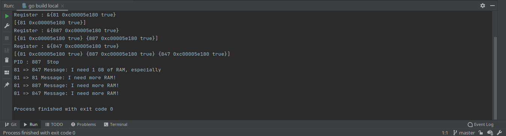

## Actor Model
Go implementation of pattern Mediator

---
### How to start

````
1. Clone this repository
2. Open by GoLand project or
   $ go build main.go
   $ ./main
   or just
   $ go run main.go
````
---

### Expected Result:

